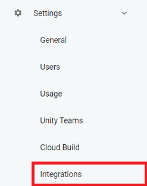

# Unity Cloud Deployer
Tool to automatically deploy your WebGL games from UnityCloud to your ASP.NET server.

## How it works
This tool is intended to be used along with Unity Cloud Builder, wich can be set to fire an action when a build is completed successfully. That action (webhook) is a POST request, sending a JSON that looks like this:
```json
{
  "buildNumber": {BUILD_NUMBER},
  "buildStatus": "success",
  "buildTargetName": "Default WebGL",
  "cleanBuild": false,
  "credentialsOutdated": false,
  "lastBuiltRevision": {LAST_COMMIT},
  "links": {
    "api_self": {
      "href": "...",
      "method": "get"
    },
    "api_share": {
      "href": "...",
      "method": "get"
    },
    "artifacts": [
      {
        "files": [
          {
            "filename": "Default WebGL.zip",
            "href": {DOWNLOAD_LINK}
          }
        ],
        "key": "primary",
        "name": ".ZIP file",
        "primary": true,
        "show_download": true
      }
    ],
    "dashboard_download": {
      "href": "...",
      "method": "get"
    },
    "dashboard_download_direct": {
      "href": "...",
      "method": "get"
    },
    "dashboard_log": {
      "href": "...",
      "method": "get"
    },
    "dashboard_project": {
      "href": "...",
      "method": "get"
    },
    "dashboard_summary": {
      "href": "...",
      "method": "get"
    },
    "dashboard_url": {
      "href": "https://developer.cloud.unity3d.com",
      "method": "get"
    },
    "share_url": {
      "href": "...",
      "method": "get"
    }
  },
  "local": false,
  "orgForeignKey": {ORG_KEY},
  "platform": "webgl",
  "platformName": "Web GL",
  "projectGuid": {PROJ_ID},
  "projectName": {PROJ_NAME},
  "scmType": "oauth",
  "startedBy": {NAME}
}
```

The script parses the JSON for the download link, downloads and unzips the file and cleans up afterwards.
There is also a logging functionality for debug purposes.

## How to set up the server
For now, there are only instructions for setting it up on IIS, as I don't know how to do it on other environments. I could use some help on that.
### IIS
Download and unzip a file from [the releases page](https://github.com/MateoPeri/unity-cloud-deployer/releases). You can alternatively compile it yourself using the source code provided.
On the IIS Manager, create a new site (or a subsite ?, if you implement it on an already running website). Then,

## Unity Cloud Dashboard Configuration
On the [Cloud Dashboard](https://developer.cloud.unity3d.com/) select a project, go to settings, then integrations.



Click new intergration, and select Webhook as the integration type. Then select the services that will trigger that event. In my case, just Build Success, as I only want to upload a build if all has gone well.
Set the display name to whatever you want. The Webhook URL is the url the webhook will POST to. We set this in the [server set up section](#How-to-set-up-the-server), and by default is ```http(s)://[your server]/api/GameBuild```.

If you have set up autorization for your API, fill in the key in the Authorization Secret field.
The content type should be set to ```application/json```. The 'Disable SSL/TLS Verification' checkbox is only for servers that only have HTTP (no HTTPS).

## Used packages
- [Json.NET](https://www.newtonsoft.com/json)
- [Microsoft ASP.NET Web API](https://dotnet.microsoft.com/apps/aspnet/apis)

## Debug
You can use programs like Postman to test and debug your API. Also, the tool has a log function that saves all steps of the process in a text file.
